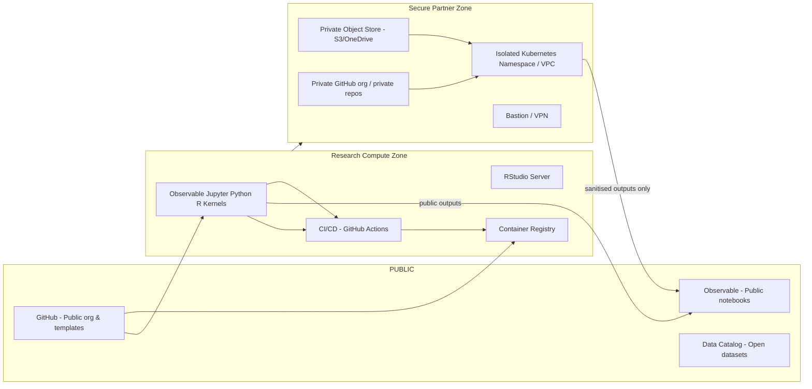

# 2\. System Design (Detailed)

## 2.1 Requirements

### 2.1.1 Stakeholder Requirements Matrix:

| Stakeholder Group | Core Objective                                                                            | Key Challenges                                                                                   | Required Platform Features                                                                                                                                                         | Technical Implications                                                                                                                       |
| :---------------- | :---------------------------------------------------------------------------------------- | :----------------------------------------------------------------------------------------------- | :--------------------------------------------------------------------------------------------------------------------------------------------------------------------------------- | :------------------------------------------------------------------------------------------------------------------------------------------- |
| PhD Student       | Conduct original research, develop skills, and build a professional portfolio.            | Isolation, time pressure, tool complexity, unclear career path.                                  | Unified notebook environment (Observable, Jupyter, R); integrated version control; peer collaboration tools; public/private portfolio management; accessible documentation.        | Premium Observable platform, containerized environments, Git integration, centralized knowledge base, role-based access control (RBAC).      |
| Faculty & Admin   | Ensure academic quality, monitor student progress, manage program operations efficiently. | Information silos; administrative overhead; managing industry partnerships.                      | Centralized student dashboard; progress tracking; in-context feedback tools; Git-based assignment workflows (e.g., template repositories); knowledge management system (KMS).      | Unified web portal with API integrations; Git-based review workflows; KMS (e.g., GitHub Wiki), SSO authentication.                           |
| Industry Partner  | Access talent and research to solve business problems; protect proprietary data and IP.   | Data security risks; lengthy legal negotiations; unclear project oversight; differing timelines. | Trusted Research Environment (TRE); synthetic data and schema generation; standardized legal agreement templates; secure project management space; controlled collaborator access. | Isolated on-prem/cloud environment (VPC); data ingress/egress "airlock"; containerization; robust logging/auditing; dedicated secure portal. |

### 2.1.2 Functional

- **Observable-first Environment:** Premium Observable platform as the default, partner-supported environment for visualization and collaborative analysis.
- **Secondary Compute:** JupyterHub multi-user environment supporting Python and R kernels for tasks not suited to Observable.
- **Git-based Collaboration:** For scenarios where observable is not sufficient, we fallback to GitHub organization with templates for reproducible projects.
- **/environment management:** `conda` + `pip` + `renv` for `R`.
- **Notebook to static export pipeline:** Observable Framework, `nbconvert`, or Quarto for publishing.
- **Data Access & Generation:** Secure data enclaves, plus mechanisms for schema generation and synthetic data generation.
- **Access Control:** Fine-grained access control and audit logging for industry datasets.

### 2.1.3 Non-functional

- Security: encryption at rest and in transit; MFA for partner accounts.
- Scalability: support \~60 active students, burst compute via cloud/HPC.
- Usability: one-click environment replication, templates, onboarding docs.
- Maintainability: containerised services, IaC (Terraform/Ansible) and CI for infra.

## 2.2 High-level architecture

- **Public/Shared zone** — for open datasets, Observable public notebooks, public GitHub org.
- **Research compute zone** — **Observable Premium Platform** (primary), supplemented by JupyterHub and RStudio-Server for specialized compute, authenticated by university SSO.
- **Secure partner zone** — Phased approach starting with **on-premise secure servers** and/or secure Observable workspaces. Evolves to an isolated cloud tenant or VPC with separate object storage, strict Firewall rules, VPN/bastion access, and per-project access control.
- **CI / Automation** — GitHub Actions for environment builds and reproducible workflows.
- **Data catalog & metadata** — lightweight catalog (e.g., DataHub, CKAN instance or markdown-based registry) tagging data as `open`, `restricted`, `confidential`.

## 2.3 Technical stack (recommended)

- **Compute & orchestration:** Kubernetes (EKS/GKE/AKS) or university HPC; use Helm for JupyterHub (Zero to JupyterHub) or JupyterHub + KubeSpawner.
- **Notebooks & IDEs:**
  - **Primary:** **Observable Premium Platform**. This is the default, partner-supported environment for all students. It is browser-based, requires zero setup, and excels at real-time collaboration and interactive visualization.
  - **Secondary:** **JupyterHub** (Python/R kernels) and **RStudio Server** for workloads not suited to Observable (e.g., heavy ML, legacy R scripts).
- **Source control:** **GitHub organization** for the CDT. This is recommended over self-hosting to reduce RSE overhead. It provides:
  - **GitHub's** tooling (e.g., template repos, and potentially GitHub Classroom) for faculty management of coursework.
  - Mature tooling, a large community, and strong integration with third-party services.
  - Excellent integration with Observable for notebook backups and local framework development.
- **Authentication:**
  - Invited Github accounts
  - University SSO (SAML/OAuth) + invited partner accounts;
  - enforce 2FA/MFA.
- **Storage:** University-backed object store (S3-compatible) with bucket policies; separate buckets/tenants for partner data.
- **Secrets & keys:** HashiCorp Vault or cloud-native KMS for secret management.
- **Container registry:** Private registry (Harbor, ECR, GCR) for reproducible images.
- **Environment reproducibility:** `conda` + `environment.yml`, `renv.lock` for R; Quarto for notebooks to HTML/website.
- **Observability & logging:** Prometheus + Grafana for metrics; ELK or Loki for logs.
- **Infrastructure as Code:** Terraform + Helm + GitOps (ArgoCD) for desired-state infra.

## 2.4 Research Environment & Integration patterns

This architecture uses an **"Observable-first" strategy**. This is the **default path** for all students and the primary, fully supported environment. It is supplemented by a robust, containerized fallback for all other computational tasks, all version-controlled in GitHub. **Students are only expected to use the secondary tools (Python, R) when a project's requirements make it a necessary "escape hatch"**.

- **Observable (Primary Platform):** As the program's official partner, the **premium Observable platform** is the default, fully supported environment.

  - **Mode 1: Premium Cloud Platform:** Used for zero-setup, browser-based analysis, real-time "multiplayer" collaboration, and easy sharing of private notebooks within the CDT and with partners.
  - **Mode 2: Observable Framework (Local):** For more complex, software-defined projects, students will use the **Observable Framework**. This allows them to build data apps as local Markdown, JS, and data files, which are naturally version-controlled in their GitHub repository.
  - **Git Integration:** Work on the cloud platform can be automatically backed up to GitHub repositories using webhooks and GitHub Actions.

- **Jupyter & R (Secondary Compute):** For tasks outside Observable's scope (e.g., training large ML models, using legacy R libraries), the CDT will provide a secondary compute environment orchestrated by **JupyterHub**.

  - **Orchestration:** JupyterHub will launch isolated, single-user **containerized** environments, allowing a student to choose a "JupyterLab" or "RStudio Server" profile.
  - **Git Integration:** The JupyterLab environment will be pre-configured with the `jupyterlab-git` extension for a graphical Git interface. We will also enforce notebook-friendly diffing and merging using tools like `nbdime` and pre-commit hooks to clear output cells, ensuring repositories remain clean.
  - **Interoperability:**
    - The `observable-jupyter` library can be used to embed Observable cells directly into Jupyter notebooks for mixed workflows.
    - The `rpy2` library will be included to provide a seamless bridge between R and Python in the same analysis.

- **d3:** Delivered as JS modules within Observable and as static outputs (via `IPython.display.HTML`) or saved files from Jupyter/R.

- **Data flow (Core Principle):** Data is **always isolated from the notebook**. Notebooks are the presentation/analysis layer. Data is stored in Git (for L1-L2 data) or the secure object store (for L3 data) and loaded at runtime.
