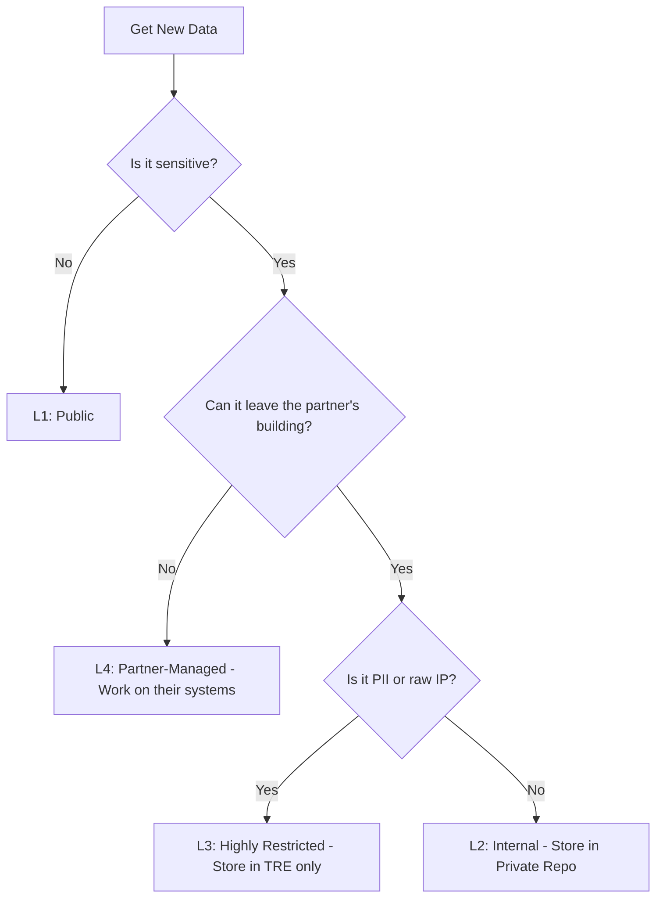
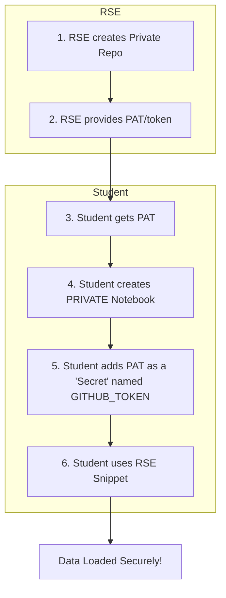

# Working Smart, Safe, and Clean: Your PhD Digital Toolkit

**Date:** Thursday 13th November, 2025
**Presented by:** Chidi Ekuma, Research Software Engineer (RSE)

---

## Welcome

### Who am I?

I'm **Chidi**, Research Software Engineer (RSE).

My role is simple: **I am here to help you.** I manage our technical infrastructure and support you with the coding, data, and software challenges you'll face during your PhD.

> I’m here to help you. Think of me as your Gandalf — guiding you through the technical wilderness — or your Dumbledore, making sure you’ve got the right spells, tools, and magic to survive your research quest

|  |  |
| :-------------------------------------------------------------------------------------: | :------------------------------------------------------------------------------------------------------------------------------------------------------------------: |

<!-- 
 -->

---

### What We'll Cover Today

The goal for the next two hours is to give you a foundational toolkit for your PhD. We'll cover the three themes from the email:

1.  **Data Management:** How to handle data safely and professionally.
2.  **Backing Up:** How to make sure you never lose your work.
3.  **Information Architecture:** How to structure your projects so they make sense (to you, your supervisors, and your future self\!).

### Our "Observable-First" Philosophy

You'll hear me say this a lot. Your program is built on an **"Observable-First"** approach.

- **This is your default path:** Observable is our primary, partner-supported platform. It’s browser-based, collaborative, and requires no setup. The vast majority of your work will happen here.
- **What about Python/R/etc.?** We call these our **"escape hatches"**. They are powerful, secondary tools for _exceptional_ cases where a project has a special need (like heavy ML).

---

## Part 1: Data Management (The "Why")

### The "Digital Horror Story"

#### Headline: "Why are we here?"

We're here to prevent the single most terrifying phrase a PhD student can hear:

> "The file is corrupt and I have no other copy."

> "Error: Notebook not found."

> "Which version is the final one? `Thesis_v5_Final_USE_THIS_ONE_v2.docx`"

---

### Icebreaker

Let's be honest, what's your current digital "guilty secret"?

- **Show of hands:** Who has an 'Untitled' Document or Observable notebook they can't identify?
- **Show of hands:** Who saves _everything_ to their Desktop or Downloads folder?
- **Show of hands:** Who names files `results_1.csv`, `results_2.csv`?

**The Goal:** Today isn't about criticising. It's about giving you a simple system to **save time**, **reduce stress**, and **protect your most valuable asset: your work.**

---

### Module 1: What is "Research Data"? (The 'Big Picture')

#### Headline: It's Not Just a Spreadsheet

Your "data" is the **entire ecosystem** of your research. It's all the digital 'stuff' you create and use.

This includes:

- **Raw Data:** The original files. Sensor readings, survey results, interview transcripts, images. (The stuff you **never** edit).
- **Processed Data:** The cleaned, filtered, or transformed data (e.g., `cleaned_data.csv`).
- **Code & Notebooks:** Your Python/R scripts, and **yes, your Observable notebooks.** The notebook _is_ data, and it also _contains_ code and analysis.
- **Writing & Notes:** Your digital lab notebook, drafts of your thesis, and your `README.txt` files.
- **Literature:** Your Zotero or Mendeley library.

### Why Bother? (The 3 Key Motivations)

1.  **Your Future Self:** The \#1 person you are helping is **you in 6 months.** "Future You" will be trying to find that one figure for a paper and will thank "Past You" for being organized.
2.  **Your Funder:** Most funding bodies (like UKRI) **require** you to have a Data Management Plan (DMP). They want to know you're a good steward of the data their money is paying to create.
3.  **Your Field (Reproducibility):** Good science is reproducible. This starts with good data management. This leads to the **FAIR** Principles.

### The FAIR Principles (A Quick Look)

Your data (and notebooks\!) should be:

- **Findable:** Can you (and others) find it?
- **Accessible:** Can you open it? Is it in a non-proprietary format?
- **Interoperable:** Can it be used with other data or systems?
- **Reusable:** Is it documented well enough for someone (or "Future You") to understand and re-use it?

---

## Data Management in the CDT (The 'What')

"Data Management" is a fancy term for something simple: **Not losing your work and not leaking secrets.**

So, how do we apply these FAIR principles in our CDT?

### Our "Observable-First" Philosophy

Your PhD is built on an **"Observable-First"** approach.

- **This is your default path:** Observable is our primary, partner-supported platform. It’s browser-based, collaborative, and requires no setup. The vast majority of your work will happen here.
- **"Escape Hatches":** For exceptional cases (like heavy ML), we have "escape hatches" like Python/R. We will run optional workshops on these next year.

* **Don't worry\!** You are not expected to know these other tools now. We will provide optional workshops on them later in the program. Today, we focus on the core workflow.

Because you'll handle data all the time. To do it safely, we must first know _what_ kind of data we have.

### The 4 Levels of Data

In our CDT, we classify all data into four simple levels. This tells us exactly where it's allowed to live.

| Level  | Classification        | What It Is (Examples)                                                      | Where It Lives                                                          |
| :----- | :-------------------- | :------------------------------------------------------------------------- | :---------------------------------------------------------------------- |
| **L1** | **Public**            | Open-source code, published papers, `data.gov.uk` datasets.                | **Public GitHub** Repositories                                          |
| **L2** | **Internal**          | Course materials, draft manuscripts, non-sensitive data for our cohort.    | **Private GitHub** Repositories                                         |
| **L3** | **Highly Restricted** | **The sensitive stuff.** PII, raw partner data, commercially sensitive IP. | The **Trusted Research Environment (TRE)**. (A secure "airlock" server) |

### The Special Case: L4 (Partner-Managed)

You'll notice L4 isn't in the main table. That's because it **never touches our systems.**

> **L4 (Partner-Managed):** This is for extreme-case data that a partner **will not** let leave their building. For an L4 project, you would work _on their computers_, at their office, using their security. We don't manage it, but we support you.

### Our Data Flow

This diagram shows how we decide what to do with any piece of data.



> **Your main takeaway:** Today, we are only focusing on **L1** and **L2**. You will get special training before you _ever_ touch L3 or L4 data.

---

## Part 2: The "How" (Hands-On Session)

Now, let's practice. There are two "Approved"/Recommended ways to load data into Observable.

### Method 1: L1 (Public) Data 🌍

This is the method for any public data. It's the most common and the one you'll use for your public portfolio.

- **Step 1:** Upload your file (e.g., `my_public_data.csv`) to a **Public** GitHub repository.

- **Step 2:** Click on the file, then click the **"Raw"** button to get the real URL.

- **Step 3:** Use that URL in Observable's `FileAttachment` command.

#### L1 Code Snippet:

```javascript
// This cell loads a PUBLIC CSV file from a GitHub Raw URL
myPublicData = FileAttachment(
  "https://gist.githubusercontent.com/rnirmal/e01acfdaf54a6f9b24e91ba4cae63518/raw/6b589a5c5a851711e20c5eb28f9d54742d1fe2dc/datasets.csv"
).csv();

// This cell loads a PUBLIC JSON file
myPublicJson = FileAttachment(
  "https://raw.githubusercontent.com/sharmadhiraj/free-json-datasets/refs/heads/master/datasets/world-population-by-country-2020.json"
).json();
```

---

### Method 2: L2 (Internal) Data 🔐

This is the standard, secure method for **internal** data (like assignments or cohort-only drafts).

#### Why not just upload the file?

You _can_ upload files, but we don't teach it as the default. Why? If you upload a file to a notebook and then accidentally make that notebook public, you've leaked the data.

Our L2 method makes this impossible.

> **Security by Default:** This method uses Observable's **Secrets** manager. Observable **will not allow you to use a Secret in a public notebook**. This process _enforces_ privacy and removes the risk of you accidentally exposing internal data.

#### The L2 Workflow



#### Step-by-Step Guide (L2)

1.  **Get Your Token:** For an L2 project, I (Chidi) will give you a **Personal Access Token (PAT)** that _only_ has access to that one private repository.

2.  **Create a _Private_ Notebook:** This method _only_ works in a private notebook.

3.  **Store the Token as a Secret:**

    - In your private notebook, click the **three-dot menu (`...`)** and select **"Secrets"**.
    - Click **"New secret"**.
    - **Name:** `GITHUB_TOKEN`
    - **Value:** `ghp_...` (Paste the token I gave you).
    - Click **"Save"**.

4.  **Use the Snippet:** Copy the correct snippet below into a new cell. You only need to change the `REPO_PATH` and `FILE_PATH` variables.

---

### **L2 SNIPPET (for CSV files):**

```javascript
// Copy-paste this entire cell to load a private CSV file

myPrivateCSV = {
  // --- Required ---
  // 1. Get the token you stored in Secrets
  const token = await Secrets.get("GITHUB_TOKEN");

  // 2. Define your repository and file path
  const REPO_PATH = "CDT-ORG/MY-PRIVATE-ASSIGNMENT-REPO"; // e.g., "CDT-ORG/workshop-1-data"
  const FILE_PATH = "data/my_assignment_data.csv"; // e.g., "students/my_data.csv"

  // --- RSE Magic (No need to change) ---
  const url = `https://api.github.com/repos/${REPO_PATH}/contents/${FILE_PATH}`;

  const response = await fetch(url, {
    headers: {
      Accept: "application/vnd.github.v3.raw",
      Authorization: `token ${token}`
    }
  });

  if (!response.ok) throw new Error(`Fetch failed: ${response.status}`);

  const text = await response.text();
  return d3.csvParse(text); // Uses d3's parser
}
```

---

### **L2 SNIPPET (for JSON files):**

```javascript
// Copy-paste this entire cell to load a private JSON file

myPrivateJSON = {
  // --- Required ---
  // 1. Get the token you stored in Secrets
  const token = await Secrets.get("GITHUB_TOKEN");

  // 2. Define your repository and file path
  const REPO_PATH = "CDT-ORG/MY-PRIVATE-ASSIGNMENT-REPO"; // e.g., "CDT-ORG/workshop-1-data"
  const FILE_PATH = "data/my_assignment_data.json"; // e.g., "students/my_data.json"

  // --- RSE Magic (No need to change) ---
  const url = `https://api.github.com/repos/${REPO_PATH}/contents/${FILE_PATH}`;

  const response = await fetch(url, {
    headers: {
      Accept: "application/vnd.github.v3.raw", // We get raw text first
      Authorization: `token ${token}`
    }
  });

  if (!response.ok) throw new Error(`Fetch failed: ${response.status}`);

  const text = await response.text();
  return JSON.parse(text); // Uses JavaScript's built-in parser
}
```

---

### Your Turn: Interactive Exercise

Let's do this together.

- **Task 1 (L2):**

  1.  I have just given you all a PAT.
  2.  Create a **new, private** notebook.
  3.  Add the PAT as a Secret named `GITHUB_TOKEN`.
  4.  Use the **L2 CSV Snippet** to load the file from:
      - `REPO_PATH`: `CDT-ORG/workshop-data-internal`
      - `FILE_PATH`: `assignment-1.csv`
  5.  In a new cell, type `myPrivateCSV` to see the data.

- **Task 2 (L1):**

  1.  In the _same_ notebook, create a new cell.
  2.  Use the **L1 Method** (`FileAttachment`) to load this _public_ data file:
  3.  `https://raw.githubusercontent.com/plotly/datasets/master/finance-charts-apple.csv`
  4.  See if you can load it and display the data.

---

## Part 3: Backups & Architecture

You now know how to manage data. But how do you manage your _notebooks_?

### Theme 2: Backing Up Your Work

**"Do I need to learn all of Git right now?"**

No. We will introduce Git properly later. For now, Observable has you covered.

#### Good: The "Oops" Button (Version History)

Observable automatically saves your work.

- Click the **clock icon** (Version History) in the top right.
- You can see every change you've made and revert to any previous version.
- This is your \#1 backup tool.

#### Better: Manual Download

- Click the **three-dot menu (`...`)**
- Go to **"Export"**
- Select **"Download code"**
- This saves a copy of your notebook to your computer. Do this before any major changes.

#### Best: GitHub Archival

- We can fully link your Observable notebook to a GitHub repository for a complete, version-controlled backup.
- This is an advanced topic that we will cover in a **future optional workshop**. For now, just know that it's possible.

---

### Theme 3: Information Architecture

This just means: **"How to make your notebooks readable."**

Your supervisors (and your "future self" in 6 months) will thank you.

#### The "Bad" Way (Don't do this\!)

```javascript
// cell_1
data = FileAttachment("...").csv()

// cell_2
viewof selection = ...

// cell_3
filteredData = data.filter(...)

// cell_4
Plot.plot(...)
```

> **What's wrong?** No comments, no labels, no structure. This is confusing.

#### The "Good" Way (Do this\!)

```javascript
// ---
// ## 1. Load Data
// First, we load the raw CSV file from its public source.
// ---

rawData = FileAttachment("...").csv();
```

```javascript
// ---
// ## 2. Clean and Filter Data
// Here, we filter the data based on the user's selection.
// ---

filteredData = rawData.filter((d) => d.year === 2025);
```

```javascript
// ---
// ## 3. Main Visualization
// This plot shows the final, filtered results.
// ---

myFinalPlot = Plot.plot({...})
```

#### Your 3 Rules for Clean Notebooks

1.  **Use Markdown.** Use headers (`#`, `##`) and text cells to _explain what you are doing_ and _why_.
2.  **Name Your Cells.** Don't use `cell_123`. Give them meaningful names (e.g., `rawData`, `cleanedData`, `mainChart`).
3.  **Separate Your Logic.** Don't put everything in one giant cell. Have a cell for loading, a cell for cleaning, and a cell for visualizing.

---

## Wrap-Up & Q\&A

### What We Learned Today

1.  **Data Management:** The 4 Levels (L1-L4) and how to decide where data lives.
2.  **Hands-On Data:** How to load **L1 (Public)** data with `FileAttachment` and **L2 (Internal)** data securely with **Secrets**.
3.  **Backups:** To use Observable's built-in **Version History** as your primary backup.
4.  **Architecture:** To use Markdown and cell-naming to keep your notebooks clean.

### Where to Get Help

- **This Document:** Bookmark this page\! It's your reference.
- **The CDT Knowledge Wiki:** We will build this out with more guides.
- **Me\!** Email me, find me on Teams. I'm here to help.

## Questions?
